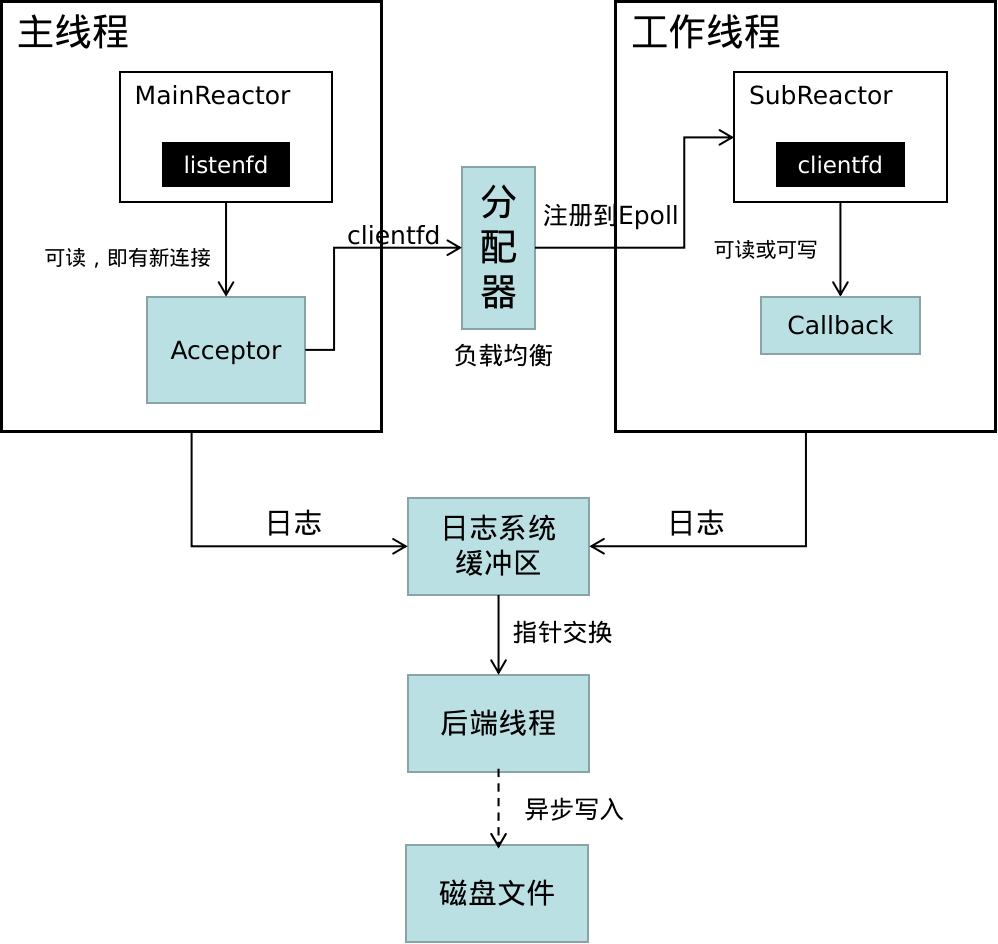
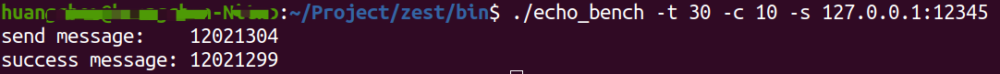

## 介绍

Zest是一个轻量的网络库，基于主从Reactor模式，使用C++编写。

https://github.com/huanggomery/zest

网络库架构图：



## 环境

+ Linux kernel version 5.15.0-83-generic

+ g++ 9.4.0

+ xmake 

xmake是一个跨平台自动构建工具，如果你还没有安装xmake，请访问 https://xmake.io 查看如何下载安装。

## 构建

首先，clone本项目，并进入目录

```bash
git clone https://github.com/huanggomery/zest.git
cd zest
```

然后运行

```bash
./build.sh
```

你也可以自己指定安装路径（默认是安装到 `/usr/local`）

```bash
./build.sh /your/specify/path/
```

## 示例

在 `example` 目录中，你可以看到几个C++文件，演示了如何用zest网络库去创建一个回声服务器和客户端。另外，还提供了一个压力测试工具，测试回声服务器。

运行了 `./build.sh` 之后，你可以在 `bin` 目录中发现下面三个可执行文件：

+ `echo_server`
+ `echo_client`
+ `echo_bench`

首先运行 `echo_server`，然后运行`echo_client`，它会每隔一秒向服务器发送数据，然后打印收到的数据。

`echo_bench` 是一个压力测试工具。你可以使用 `-h` 选项来获取它的使用方法：

```bash
./echo_bench -h
```

这是一个压力测试结果：



你也许注意到了两个数据不一致，那是因为部分客户端在发送数据后，还没来得及收到数据，定时器就到期了。

## 使用教程

首先，如果你想使用日志系统，就需要调用 `zest::Logger::InitGlobalLogger()` 来完成初始化，例如：

```c++
#include "zest/base/logging.h"
zest::Logger::InitGlobalLogger("DEBUG", "echo_server", "../logs/");
```

你需要为你的服务器对象绑定一个监听地址，例如创建一个IPv4地址：

```c++
zest::net::InetAddress local_addr("127.0.0.1", 12345);
```

`zest::net::InetAddress` 支持多种构造函数：

```c++
InetAddress(const std::string &addr_str);
InetAddress(const std::string &ip_str, uint16_t port);
InetAddress(const char *addr_str);
InetAddress(const char *ip_str, uint16_t port);
InetAddress(sockaddr_in addr);
InetAddress(in_addr_t ip, uint16_t port);
```

然后，你就可以创建一个 `TcpServer`，需要地址和线程数作为参数：

```c++
zest::net::TcpServer server(local_addr, 4);
```

使用下面的接口，来为不同的事件（连接、可读、可写、断开）绑定回调函数。回调函数必须是这种类型的：

`void yourCallback(zest::net::TcpConnection &conn)`

```c++
// interface functions
void setOnConnectionCallback(const ConnectionCallbackFunc &cb);
void setMessageCallback(const ConnectionCallbackFunc &cb);
void setWriteCompleteCallback(const ConnectionCallbackFunc &cb);
void setCloseCallback(const ConnectionCallbackFunc &cb);
```

在回调函数中，你可以使用 `zest::net::TcpConnection` 提供的各种接口：

|            接口            |                        参数                         |           输出            |             备注             |
| :------------------------: | :-------------------------------------------------: | :-----------------------: | :--------------------------: |
|      `waitForMessage`      |                          -                          |             -             |                              |
|           `data`           |                          -                          |        std::string        |     获取接收缓存中的数据     |
|         `dataSize`         |                          -                          |        std::size_t        |      接收缓存中的数据量      |
|           `send`           |              std::string / char * str               |             -             |           发送数据           |
|           `send`           |          const char *str, std::size_t len           |             -             | 发送str指向的前len个字节数据 |
|        `clearData`         |                          -                          |             -             |         清除接收缓存         |
|      `clearBytesData`      |                         int                         |             -             |  清除接收缓存中n字节的数据   |
|         `shutdown`         |                          -                          |             -             |        半关闭TCP连接         |
|          `close`           |                          -                          |             -             |         断开TCP连接          |
|         `socketfd`         |                          -                          |            int            |          获取套接字          |
|       `peerAddress`        |                          -                          | zest::net::NetBaseAddress |         获取对端地址         |
|         `setState`         |                 zest::net::TcpState                 |             -             |                              |
|         `getState`         |                          -                          |    zest::net::TcpState    |                              |
|    `setMessageCallback`    |   std::function\<void(zest::net::TcpConnection&)>   |             -             |                              |
| `setWriteCompleteCallback` |   std::function\<void(zest::net::TcpConnection&)>   |             -             |                              |
|     `setCloseCallback`     |   std::function\<void(zest::net::TcpConnection&)>   |             -             |                              |
|         `addTimer`         | std::string, uint64_t, std::function\<void()>, bool |             -             |      为连接添加定时事件      |
|        `resetTimer`        |                     std::string                     |             -             |                              |
|        `resetTimer`        |                std::string, uint64_t                |             -             | 使用新的时间间隔来重置定时器 |
|       `cancelTimer`        |                     std::string                     |             -             |                              |
|   `deleteFromEventLoop`    |                          -                          |             -             |                              |

***另外，`zest::net::TcpConnection` 提供了2个接口，来向TCP连接中存取任意类型的数据：***

```c++
template <typename ValueType, typename... Args>
bool Put(const std::string &key, Args&&... args);

template <typename ValueType>
ValueType* Get(const std::string &key) const;
```

你可以这样使用：

```c++
// conn is a zest::net::TcpConnection object.
// Foo is a user-defined class that has a constructor Foo(int, double)

conn.Put<Foo>("my_foo", 42, 3.14);   // create a Foo(42, 3.14) named "my_foo" and then put it into conn
Foo* foo = conn.Get<Foo>("my_foo");  // get it by its name "my_foo"
```

***这使得你可以使用自定义的数据结构来记录每个TCP连接的状态，实现更丰富的功能。***

